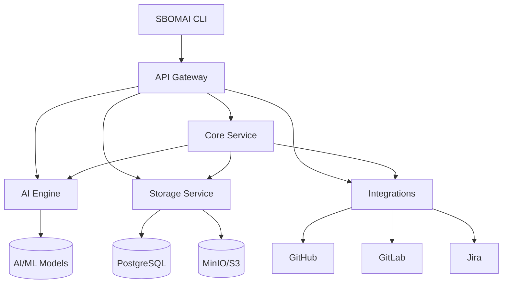

# SBOMAI - AI-Powered SBOM Analysis Tool

SBOMAI is a comprehensive, AI-powered Software Bill of Materials (SBOM) analysis tool that combines advanced machine learning, graph neural networks, and large language models to provide intelligent vulnerability detection, risk assessment, and policy enforcement.

## 🌟 Features

### 🤖 AI-Powered Analysis
- **Risk Explanation**: Explain why specific component versions are risky using AI models
- **Risk Prediction**: Predict risk scores for components using ML models
- **Fix Suggestions**: Generate intelligent remediation suggestions
- **Explainable Chains**: Create explainable analysis chains for entire SBOMs
- **Predictive Vulnerability Detection**: Advanced Graph Neural Network analysis for predicting vulnerabilities before they're disclosed

### 📊 SBOM Processing
- **Multiple Formats**: Support for SPDX, CycloneDX, and SWID
- **Vulnerability Scanning**: Integration with NVD, OSS Index, OSV, and more
- **Policy Enforcement**: Customizable rules and compliance checks
- **Dependency Analysis**: Deep analysis of dependency relationships and risks

### 🔌 Integrations
- **GitHub/GitLab**: Automated scanning and reporting
- **Jira**: Issue tracking and workflow integration
- **Dependency-Check**: Enhanced vulnerability scanning
- **CI/CD**: GitHub Actions, Jenkins, Azure DevOps

### 📈 Monitoring & Observability
- **Grafana Dashboards**: Real-time metrics and visualization
- **Prometheus**: Time-series metrics collection
- **Loki**: Centralized log aggregation
- **Health Checks**: Comprehensive service monitoring

## 🏗️ Architecture

SBOMAI follows a modular microservices architecture:



### Modules
- **sbomai-common**: Common model definitions and utilities
- **sbomai-core**: Core SBOM analysis logic
- **sbomai-parser**: SBOM format parsing
- **sbomai-vulnscan**: Vulnerability scanning
- **sbomai-policy**: Policy enforcement
- **sbomai-cli**: Command-line interface
- **sbomai-api-gateway**: GraphQL/REST API gateway
- **sbomai-storage**: Persistent storage management
- **sbomai-integrations**: External service integrations
- **sbomai-engine**: Python-based AI/ML microservice

## 🚀 Quick Start

### Prerequisites
- Java 21+
- Python 3.11+
- Docker & Docker Compose
- Maven
- PowerShell (Windows) or Bash (Linux/macOS)

### Installation

1. **Clone the repository**
   ```bash
   git clone <repository-url>
   cd sbomai
   ```

2. **Set up environment variables**
   ```bash
   cp .env.example .env
   # Edit .env with your configuration
   ```

3. **Start the services**
   ```powershell
   # Windows
   .\start-sbomai.ps1

   # Linux/macOS
   ./start-sbomai.sh
   ```

4. **Run a test scan**
   ```bash
   sbomai-cli analyze path/to/sbom.json
   ```

### Service URLs
- API Gateway: http://localhost:8080
- Grafana: http://localhost:3000 (admin/sbomai2024)
- Prometheus: http://localhost:9091
- MinIO Console: http://localhost:9001

## 📚 Documentation

- [Architecture Overview](docs/ARCHITECTURE.md)
- [API Documentation](docs/API.md)
- [CLI Usage Guide](docs/CLI.md)
- [Configuration Guide](docs/CONFIGURATION.md)
- [Development Guide](docs/DEVELOPMENT.md)
- [Monitoring Setup](docs/MONITORING.md)
- [Integration Guide](docs/INTEGRATION.md)

## 🛠️ Development

### Building from Source

```bash
# Build all Java services
mvn clean install

# Build AI/ML Engine
cd sbomai-engine
python -m pip install -r requirements.txt
python -m grpc_tools.protoc \
    --python_out=./src \
    --grpc_python_out=./src \
    --proto_path=./protos \
    ./protos/sbomai_ai.proto
```

### Running Tests

```bash
# Run all tests
mvn test

# Run specific module tests
mvn test -pl sbomai-core

# Run AI/ML Engine tests
cd sbomai-engine
pytest
```

### Code Quality

```bash
# Java
mvn checkstyle:check
mvn spotbugs:check

# Python
cd sbomai-engine
black src/ tests/
flake8 src/ tests/
mypy src/
```

## 🤝 Contributing

1. Fork the repository
2. Create a feature branch
3. Make your changes
4. Add tests
5. Run the test suite
6. Submit a pull request

See [CONTRIBUTING.md](CONTRIBUTING.md) for detailed guidelines.

## 📄 License

This project is licensed under the MIT License - see the [LICENSE](LICENSE) file for details.

## 🙏 Acknowledgments

- OpenAI GPT models for advanced reasoning
- Anthropic Claude for safety-focused analysis
- Google Gemini for efficient processing
- PyTorch Geometric for graph neural networks
- Spring Boot for robust microservices
- Grafana Labs for monitoring tools